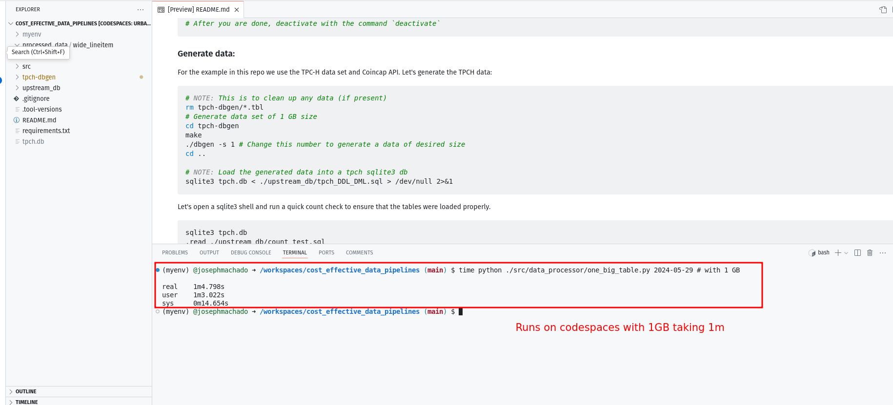
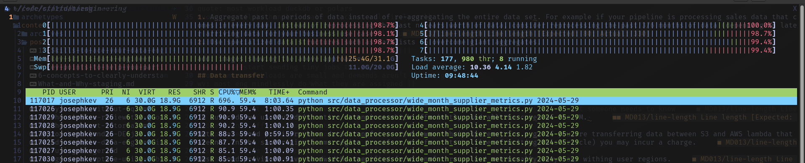

* [Cost Effective Data Pipelines](#cost-effective-data-pipelines)
    * [Setup](#setup)
        * [Run on CodeSpaces](#run-on-codespaces)
        * [Run code on your machine](#run-code-on-your-machine)
    * [Generate data](#generate-data)
    * [Data processing](#data-processing)

# Cost Effective Data Pipelines

Code for blog at: [Building cost effective data pipelines with Python & DuckDB](https://www.startdataengineering.com/post/cost-effective-pipelines/) 

## Setup

### Run on CodeSpaces

You can run the code in the repo with Codespaces. 

1. Fork this repo.
2. Click on code button and select the codespaces tab.
3. Click on the `Create codespace on main` button.



When codespaces open, wait for it to complete installing the required libraries from [./requirements.txt](./requirements.txt).


You can open a Python REPL and run the scripts in the [generate data section](#generate-data).

### Run code on your machine

Alternatively you can run this code on your machine. You'll need the following:

1. [Python 3.8 or above](https://www.python.org/downloads/)
2. [sqlite3](https://www.sqlite.org/index.html)
3. Sufficient disk memory (depending on if you want to run with 1 or 10 or 100GB)


Clone the repo and create a virtual env and install the libraries needed:

```bash
git clone https://github.com/josephmachado/cost_effective_data_pipelines.git
cd cost_effective_data_pipelines

python3 -m venv myenv
# windows
# myenv\Scripts\activate
# Linux
source myenv/bin/activate
pip install -r requirements.txt
# After you are done, deactivate with the command `deactivate`
```

## Generate data

For the example in this repo we use the TPC-H data set and Coincap API.
Let's generate the TPCH data, by running the following commands in your terminal:

```bash
# NOTE: This is to clean up any data (if present) 
rm tpch-dbgen/*.tbl
# Generate data set of 1 GB size
cd tpch-dbgen
make
./dbgen -s 1 # Change this number to generate a data of desired size
cd ..

# NOTE: Load the generated data into a tpch sqlite3 db
sqlite3 tpch.db < ./upstream_db/tpch_DDL_DML.sql > /dev/null 2>&1
```

Let's open a sqlite3 shell and run a quick count check to ensure that the tables were loaded properly.

```sql
sqlite3 tpch.db
.read ./upstream_db/count_test.sql
/* 
Your output will be (if you generated a 1GB dataset)
150000
6001215
25
1500000
200000
800000
5
10000
*/
.exit  -- exit sqlite3
```

## Data processing

You can run the ETL scripts using the `make up` command. 
```bash
make up
```

Alternatively you can run the scripts individually as shown below.

```bash
time python ./src/data_processor/exchange_data.py 2024-05-29
time python ./src/data_processor/dim_parts_supplier.py 2024-05-29
time python ./src/data_processor/one_big_table.py 2024-05-29
time python ./src/data_processor/wide_month_supplier_metrics.py 2024-05-29
# This last script will fail on base CodeSpace VM, see here for powerful Codespace VMS:`
# https://docs.github.com/en/codespaces/customizing-your-codespace/changing-the-machine-type-for-your-codespace?tool=webui
```

Running the ETL on a 8 core, 32 GB RAM, 1TB HDD 2017 Thinkpad with performs as shown below. The script [wide_month_supplier_metrics.py](./src/data_processor/wide_month_supplier_metrics.py) ran in 7m and 20s, this included reading in about 10GB of data, ineffectively processing it and writing it out.

Resource utilization:



**NOTE:** The code in this repo can be optimized following principles stated in [this performance guide](https://duckdb.org/docs/guides/performance/overview.html).
